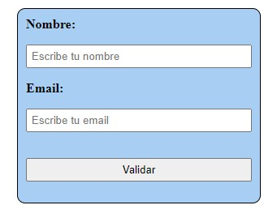
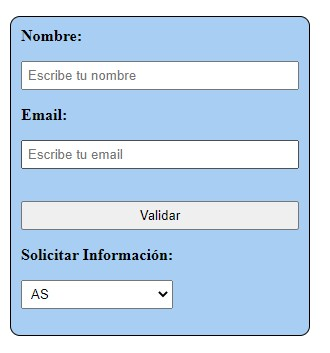
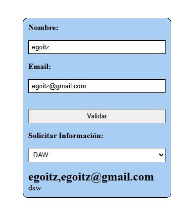

# SpeedTest2-DOMJS
I'm not just a script, I'm a DOM-inator with JavaScript powers!

## DOM eta formularioen kudeaketa
Hurrengo egitura duen web orri bat dugu:

- **Nombre**: Ezin da hutsik egon. Luzera maximoa 20 karaktere, bakarrik letrak eta espazio hutsak
- **Email**: ezin da hutsik egon. Email formatua izan behar du.

**Validar** botoia sakatzerakoan, datuak ondo daudela konprobatuko du.
- Zuzenak ez badira, dagokion eremuan fokoa jarriko du eta eremuaren bordea gorriz jarriko du.
- Datuak zuzenak badira, ziklo desberdineko informazioa hautatzeko erakutsiko egingo du.

Behin zikloa hautatzen denean (aukera bat hartzerakoan), Sortuko dira html elementu berriak DOM instrukzioak erabiliz hurrengoa erakusteko (ez erabili innerHTML):
1. `<h2>` bat, erabiltzailearen izenarekin eta emailarekin.
2. `
` bat, hautatutako zikloaren izenarekin.

